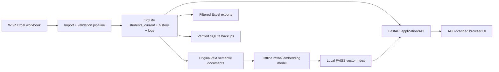
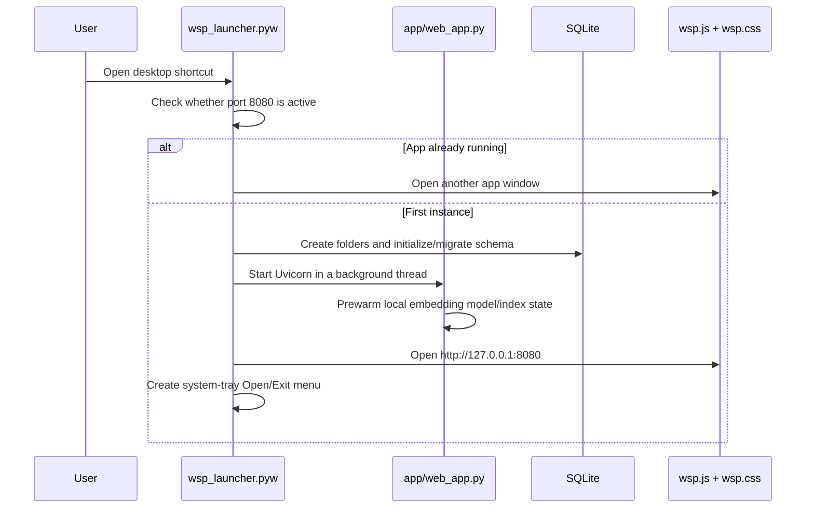
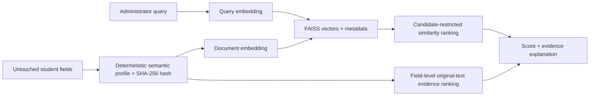

# Architecture

[Documentation home](README.md) · [Feature and code flows](FEATURES_AND_CODE_FLOW.md) · [Complete code reference](CODE_REFERENCE.md)

## System boundary

WSP Offline System is a local Windows desktop-style application. A Python launcher starts a FastAPI server on `127.0.0.1:8080` and opens the user interface in an app-style browser window. Student data, SQLite records, workbook archives, exports, backups, model files, and vector indexes remain on the computer.


## Runtime layers

| Layer | Main responsibility | Primary code |
|---|---|---|
| Windows entry points | Install, repair, launch, tray behavior, shutdown, uninstall | [installer](code_reference/scripts/install.ps1.md), [launcher](code_reference/wsp_launcher.pyw.md), [uninstaller](code_reference/scripts/uninstall.ps1.md) |
| HTTP/UI shell | Routes, HTML shell, API adapters, import orchestration, diagnostics | [web_app.py](code_reference/app/web_app.py.md) |
| Browser controller | User interaction, rendering, state, saved preferences, charts, profiles | [wsp.js](code_reference/app/static/wsp.js.md) |
| Design system | Responsive layout, AUB palette, tables, profiles, print, animation | [wsp.css](code_reference/app/static/wsp.css.md) |
| Domain services | Import, filtering, analytics, profiles, backups, grouping, search | [services index](CODE_REFERENCE.md#services) |
| Persistence | SQLAlchemy models, SQLite engine, migrations, column registry | [database index](CODE_REFERENCE.md#database) |
| Local intelligence | Semantic documents, embedding model, FAISS store, evidence/explanations | [semantic search](code_reference/services/semantic_search_service.py.md) |
| Verification | 346 tests, diagnostics, audit scripts, testbenches | [tests index](CODE_REFERENCE.md#tests) |
| Distribution | Release builder, SHA-256 manifests, GitHub Actions release | [release workflow](code_reference/.github/workflows/windows-release.yml.md) |

## Main process lifecycle



## Data lifecycle

1. An administrator places the newest `.xlsx` or `.xlsm` file in Import Folder.
2. The 30-second folder check or **Check Now** detects supported stable files.
3. The importer hashes the workbook, rejects exact duplicates, reads the first worksheet, normalizes headers, and requires usable `STUD_ID` values.
4. A pre-import database backup is created and integrity-checked.
5. The original workbook is archived and a pending `ImportBatch` is recorded.
6. In one database transaction, rows are normalized, merged, compared with hashes, copied to history when changed, and missing students are marked rather than deleted.
7. The column registry and import log retain schema drift and validation warnings.
8. A post-import backup is created.
9. The semantic index is marked stale, inactive vectors are pruned, and changed profiles are re-embedded.
10. Dashboard, Search & Match, Data Explorer, profiles, and exports read the updated local database.

## Semantic-search architecture



The model does not expose chain-of-thought. The UI progress card reports pipeline stages only. Match explanations cite the closest original fields and similarity scores.

## Backup and recovery architecture

- SQLite runs in WAL mode with foreign keys enabled.
- Backups are created before and after imports, before restore, and before supported manual edits.
- Every created/selected backup is checked with SQLite `PRAGMA integrity_check`.
- Restore first creates an emergency pre-restore backup, removes SQLite sidecars, copies the selected snapshot, rechecks integrity, and logs the restore.
- The UI lists reason, timestamp, size, integrity state, and Restore action.
- Uninstall can preserve `data`, Import Folder, and Export Folder under Documents before removing the app.

## Deployment layout

```text
%LOCALAPPDATA%\WSP Offline System\
|-- Import Folder\
|   `-- archive\
|-- Export Folder\
`-- wsp_offline_app\
    |-- .venv\
    |-- .models\
    |-- app\
    |-- database\
    |-- services\
    `-- data\
        |-- wsp.db
        |-- backups\
        |-- semantic_index\
        `-- logs\
```
