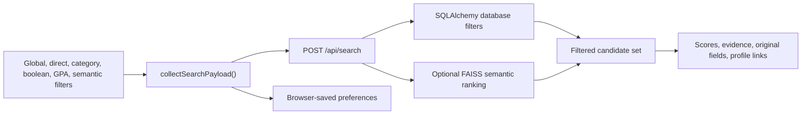
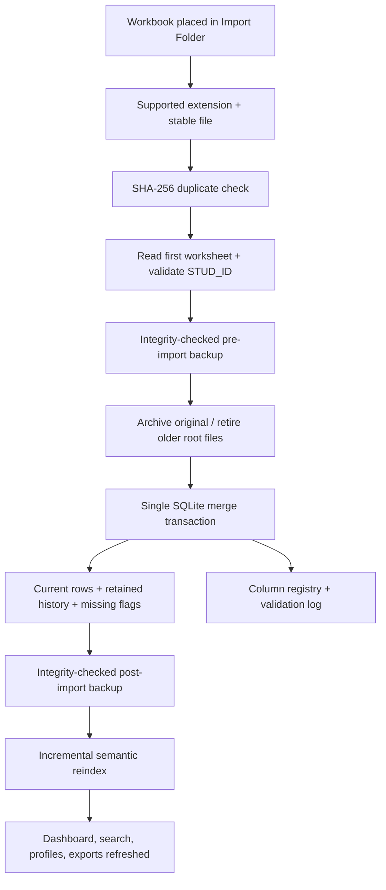

# Feature and code-flow map

[Documentation home](README.md) · [User manual](USER_MANUAL.md) · [Architecture](ARCHITECTURE.md) · [Complete code reference](CODE_REFERENCE.md)

This is the master cascade linking each usable feature to its browser control, API route, service logic, and persisted/local output.

## End-to-end feature cascade

| Feature | Browser/UI entry | HTTP/API layer | Domain/service layer | Stored result or output |
|---|---|---|---|---|
| Dashboard loading | `loadDashboard()` in [wsp.js](code_reference/app/static/wsp.js.md) | `GET /api/dashboard` in [web_app.py](code_reference/app/web_app.py.md) | [dashboard_intelligence_service.py](code_reference/services/dashboard_intelligence_service.py.md) + [analytics_service.py](code_reference/services/analytics_service.py.md) | Read-only metrics, charts, worklists, and group summaries |
| Dashboard multi-select | Faculty/major/class controls; `collectDashboardFilters()` | Query parameters on `GET /api/dashboard` | Faculty mapping and `_matches()` | URL state and refreshed view; no database mutation |
| Dashboard chart drilldown | Chart.js `onClick` → `handleDashboardChartSelection()` | Reloads dashboard query | Filtered intelligence payload | Synchronized KPIs, charts, and candidate rows |
| Saved filter preferences | `saveFilterPrefs()` / `loadFilterPrefs()` | No server call for persistence | Browser `localStorage` only | Restores filters on the same browser profile |
| Database filtering | Filter Builder and `runSearch()` | `POST /api/search` | [filter_service.py](code_reference/services/filter_service.py.md) | Result rows + `filter_runs` audit record |
| Semantic matching | Ask local AI, threshold, top K | `POST /api/search` | [semantic_search_service.py](code_reference/services/semantic_search_service.py.md), [embedding_service.py](code_reference/services/embedding_service.py.md), [vector_store_service.py](code_reference/services/vector_store_service.py.md) | Ranked candidates, match scores, original-text explanations |
| Search progress animation | `startSearchProgress()` / `finishSearchProgress()` | Observes the search request lifecycle | No hidden reasoning is exposed | AUB-maroon three-dot pipeline status |
| Excel export | Search **Export** or Import Center **Export Now** | `POST /api/export` | [export_service.py](code_reference/services/export_service.py.md) | `.xlsx` with Filtered Results + Filter Metadata; `export_log` row |
| Data Explorer | `loadExcelSheets()` / sheet tabs | `GET /api/excel-sheets` | Database queries and web payload builder | Read-only Current Students, Import Issues, Column Schema, Major Analytics views |
| Inline edits | **Edit**, cell controls, `saveSheetEdits()` | `PATCH /api/students/update` | Backup service + SQLAlchemy updates | Pre-edit backup, updated current rows, modified timestamps |
| Student lookup | Profile search input | `GET /api/students/lookup?q=...` | [student_profile_service.py](code_reference/services/student_profile_service.py.md) | Read-only ranked lookup suggestions |
| Holistic profile | Links, double-click, context menu, profile directory | `GET /api/students/{id}/profile` | [student_profile_service.py](code_reference/services/student_profile_service.py.md) | Identity, academic, skills, work, support, extras, provenance, timeline |
| Import Folder configuration | Path + **Save Folder** | `POST /api/import-folder` | Path resolution and config writer in [web_app.py](code_reference/app/web_app.py.md) | `data/import_folder_config.json` |
| Automatic folder import | 30-second page/background refresh | `POST /api/import/refresh-folder` or server refresher | [excel_importer.py](code_reference/services/excel_importer.py.md), [archive_service.py](code_reference/services/archive_service.py.md), [value_normalizer.py](code_reference/services/value_normalizer.py.md) | Current/history rows, import batch/log, archived workbook, backups |
| Manual import | **Check Now** or selected path | `POST /api/import/run` | Same safe import transaction | Same audited import outputs |
| Dynamic schema | Detected Columns Schema | `GET /api/import-center` | [schema_manager.py](code_reference/database/schema_manager.py.md) | `column_registry` tracks original/normalized names, type, first/last batch, active/new state |
| Duplicate protection | Automatic during import | Import error becomes HTTP 409/status item | File SHA-256 in [excel_importer.py](code_reference/services/excel_importer.py.md) | Duplicate workbook is skipped; prior data is unchanged |
| Missing-student retention | Automatic after valid import | Import transaction | `mark_missing_students()` | Student is marked missing and retained; not deleted |
| Automatic backups | Import, edit, restore | Backup endpoints/import workflow | [backup_service.py](code_reference/services/backup_service.py.md) | Timestamped `.db` files + `backup_log` |
| Backup restore | Backup Vault **Restore** | `POST /api/backup/restore` | Integrity check, emergency backup, safe copy | Restored database + pre-restore recovery snapshot |
| Semantic re-embedding | Index widget **Re-embed All** | `POST /api/admin/reindex?force=true` | Background reindex in [web_app.py](code_reference/app/web_app.py.md) + semantic services | Rebuilt FAISS index and semantic hashes |
| Index coverage | Import Center badge | `GET /api/admin/index-status` | Compares active IDs with vector metadata | Indexed/active counts and coverage percentage |
| System overview | System Health page | `GET /api/system-status` | Database/filesystem/model metadata | Active/total students, DB size, imports, backups, paths, disk usage |
| Selectable diagnostics | Toggles + **Run All Diagnostics** | `POST /api/system-status/diagnostics` | Eight checks in [web_app.py](code_reference/app/web_app.py.md) | Per-check pass/warn/fail, timing, measurements, details |
| One-click installation | `INSTALL WSP - ONE CLICK.bat` | Not HTTP | [install.ps1](code_reference/scripts/install.ps1.md) + [verify_install.py](code_reference/scripts/verify_install.py.md) | Installed app, venv, model, folders, shortcuts, manifest/log |
| Repair/update | Start Menu or `UPDATE_WSP.bat` | Not HTTP | Reuses verified installer | Repaired files/dependencies/model/shortcuts; preserves operational data |
| Safe uninstall | Start Menu or `UNINSTALL_WSP.bat` | Not HTTP | [uninstall.ps1](code_reference/scripts/uninstall.ps1.md) | Removes app or preserves operational data under Documents |
| Release publishing | Git tag/main push | GitHub Actions | [build_release.ps1](code_reference/scripts/build_release.ps1.md) + [workflow](code_reference/.github/workflows/windows-release.yml.md) | Verified ZIP, internal manifest, external `.sha256`, GitHub Release assets |

## Dashboard feature cascade

### Shared filtering

1. Faculty, major, and class controls support multiple checkbox selections.
2. Major options cascade from selected faculties.
3. Aid is a tri-state selection.
4. Active filters become individually removable chips.
5. The URL stores filter and active-view state, enabling Back/Forward navigation and shareable local links.
6. Every tab, KPI, chart, table, and candidate list receives the same filtered population.
7. **Clear filters** restores the complete active applicant pool.

### Placement Overview

- Candidate total, previous-experience coverage, aid context, and dorm context.
- Top technical-skill areas and preferred-work areas.
- Faculty comparison table with candidate volume and proportional context.
- Candidate directory with direct profile links.
- Latest-import status and change counts.

### Candidate Pool

- Candidates by major and class/year.
- GPA distribution and academic-stage comparisons.
- Faculty distribution and cross-filterable charts.
- Candidate drill-through list.

### Skills & Preferences

- Technical-skill topics derived from rough free text.
- Preferred-work topics derived from free text.
- Stable reviewed topics, explicit flexible/open category, dynamic emerging clusters, and needs-review buckets.
- Original responses remain available; topics never replace source text.
- Candidate list prioritizes work-study context.

### Funding & Logistics

- Financial-aid and dorm/housing context.
- Faculty/class comparisons use rates where group size would distort raw totals.
- Candidate worklist supports operational coordination.

### Data Quality

- Core-field completion, records with gaps, unmapped majors/faculties, and inactive history.
- Weakest-field-first completion chart.
- Impact-ordered cleanup queue.
- Records-to-inspect worklist.
- Empty states explain when no records require action.

## Search & Match feature cascade

- Global search covers ID, name, email, major, skills, work preferences, and related searchable student fields.
- Direct controls include name, skills, minimum/maximum GPA, multi-select major, multi-select class, probation, aid, dorms, sorting, order, and missing-student inclusion.
- Semantic search supports natural-language intent, a similarity threshold, and Top-K limit.
- Search documents use untouched technical skills, work preference, prior experience, other skill fields, and languages.
- Evidence explanations identify the closest original fields and their similarity.
- The loading animation describes pipeline stages without exposing private model reasoning.
- Saved preferences remain in the local browser profile; **Clear saved** deletes them, while **Reset** clears the current form.
- Exports include all matched rows and an audit-friendly metadata sheet.

## Import and recovery cascade

## Diagnostics catalog

| Check | What it proves |
|---|---|
| DB Connectivity | SQLite opens and core tables/counts are readable. |
| DB Integrity | `PRAGMA integrity_check`, WAL mode, page count, and database size. |
| Embedding Model | Offline model loads and returns 1,024-dimensional vectors with timing. |
| Semantic Search | Full local retrieval pipeline returns ranked matches. |
| Import Folder | Folder exists, is writable, and reports active/archive workbooks. |
| Export Folder | Folder exists, is writable, and reports exports/free disk. |
| Backup Vault | Backups exist, remain readable, and latest age/size are visible. |
| Vector Index | Active-student coverage, index size, model, and update time. |
