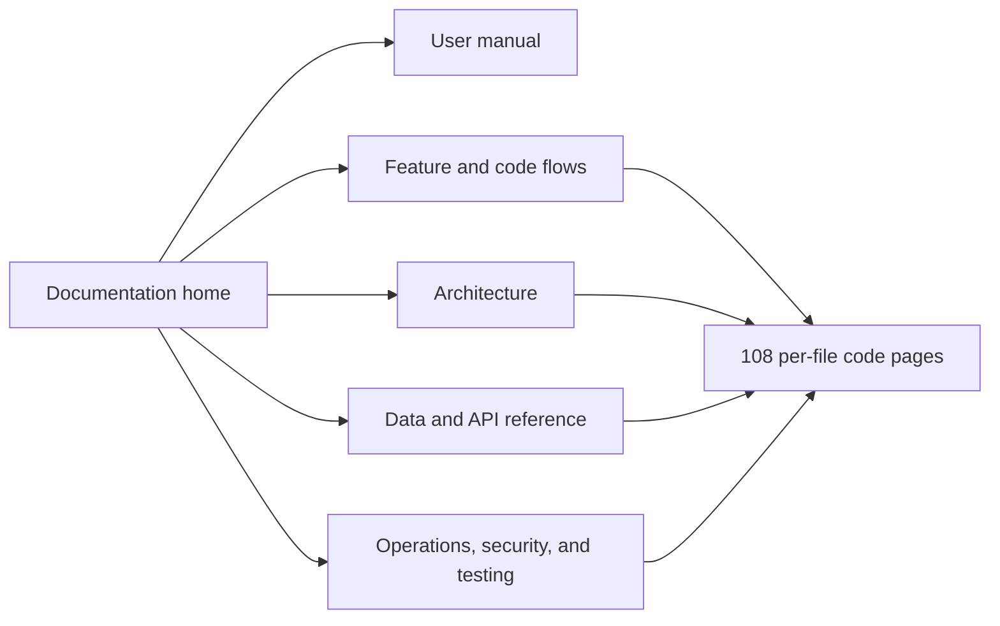

# WSP Offline System documentation

This documentation set is the technical case study, administrator manual, operating guide, and source map for WSP Offline System v1.1.0.

## Start here

| Audience | Recommended document |
|---|---|
| Work Study Program administrators | [Complete user manual](USER_MANUAL.md) |
| Presenters, reviewers, and project sponsors | [Feature and code-flow map](FEATURES_AND_CODE_FLOW.md) |
| Developers and maintainers | [Architecture](ARCHITECTURE.md) and [complete code reference](CODE_REFERENCE.md) |
| System administrators | [Operations, security, and verification](OPERATIONS_SECURITY_TESTING.md) |
| Data/API reviewers | [Data model and API reference](DATA_AND_API_REFERENCE.md) |

## Documentation map



## What is covered

- One-click Windows installation, updates, shortcuts, launcher, tray controls, and uninstallation.
- Dashboard navigation, five analytical views, cascading multi-select filters, URL state, active filter chips, drilldowns, printable output, charts, and single-category spotlight behavior.
- Database filtering, semantic matching, original-text evidence, local model progress, saved browser preferences, reset/clear behavior, and filtered Excel exports.
- Data Explorer worksheet views, global search, inline edits, automatic pre-edit backup, cancellation, and profile shortcuts.
- Holistic student profiles, directory search, academic data, skills, work-study history, programs/support, extra columns, provenance, timeline, and printing.
- Import Folder automation, workbook validation, duplicate protection, normalization, schema registry, transaction behavior, retained history, archiving, logs, and automatic semantic reindexing.
- Automatic pre/post import backups, manual-edit backups, restore safeguards, integrity checks, and retention preview logic.
- System Health overview and all eight diagnostics.
- Local-only privacy model, SQLite persistence, FAISS vectors, embedding cache, logs, and folder layout.
- Release packaging, checksum verification, GitHub Actions publishing, automated tests, testbenches, and semantic-index audits.

## Generated code documentation

[Complete code reference](CODE_REFERENCE.md) links every first-party Python, JavaScript, CSS, PowerShell, batch, workflow, test, and configuration file to a dedicated Markdown page. Rebuild it after changing public code:

```powershell
cd wsp_offline_app
.\.venv\Scripts\python.exe scripts\generate_code_documentation.py
```

The generator is documented like every other source file: [generate_code_documentation.py](code_reference/scripts/generate_code_documentation.py.md).

## Screenshots and presentation

Verified UI captures used by the PowerPoint manual are stored in [`assets/screenshots`](assets/screenshots/). The final deck is stored at [`WSP_Offline_System_Complete_Case_Study_and_User_Manual.pptx`](WSP_Offline_System_Complete_Case_Study_and_User_Manual.pptx).

## Source-of-truth rules

1. Student facts come from the current SQLite record, retained history, or preserved extra workbook columns.
2. Semantic search embeds the original student text; dashboard topic labels do not replace it.
3. Dashboard topic grouping is analytical and reversible. It does not rewrite source responses.
4. Operational state is local to the installed computer unless an administrator deliberately copies an export or backup.
5. The release checksum and internal manifest validate package integrity; they do not digitally sign the publisher.
